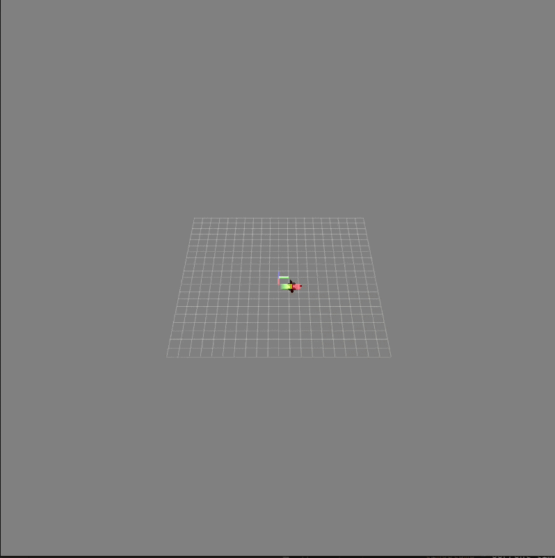
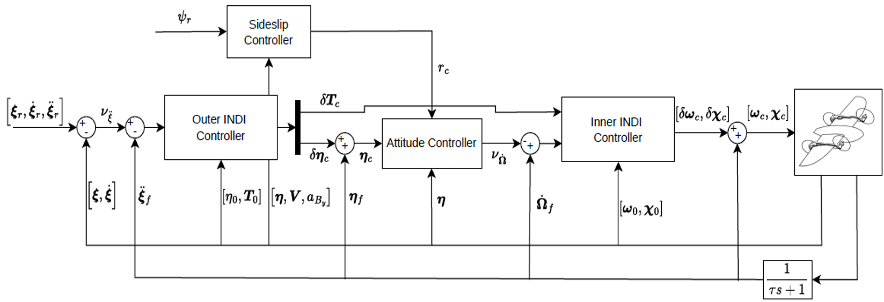
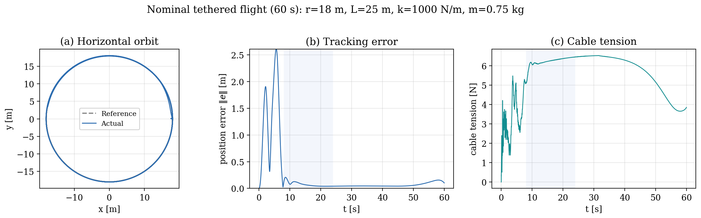
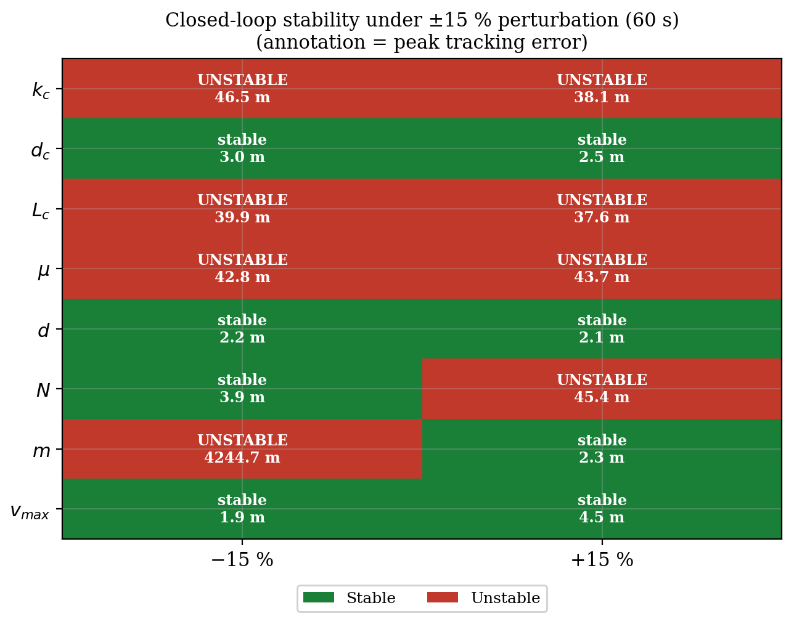

# INDI Control for Hybrid Tilt-Rotor UAVs

Simulation and control study of a single-wing quad-tiltrotor UAV in free and ground-anchored tethered flight. The project builds a nonlinear vehicle+tether model and evaluates a cascaded Incremental Nonlinear Dynamic Inversion (INDI) controller with weighted least-squares (WLS) allocation over rotor thrusts and tilt angles.

This public version gathers the main academic deliverables and a concise technical overview of the project. It includes the full report, the final defense deck and selected figures, while implementation source code, tuning files and raw logs are kept out of scope.



## Project Context

| Item | Details |
|---|---|
| Program | MSc Aerospace Engineering, Aerospace Systems and Control |
| Institutions | ISAE-SUPAERO and ENAC |
| Authors | Enrique Valverde Sacristan and Jose Ricardo Furiati Aguilar |
| Supervisors | Pr. Murat Bronz, Dr. Mauro Villanueva-Aguado, Pr. Yves Briere |
| Date | June 2026 |

## Start Here

| Artifact | Why open it |
|---|---|
| [Full report](docs/report/indi-research-project-report.pdf) | Complete RP report, modelling, controller design, simulation setup, results and bibliography |
| [Defense deck](docs/slides/indi-hybrid-uav-defense.pptx) | Final PowerPoint presentation used to explain the project visually |
| [Research overview](docs/research-overview.md) | Problem, method and contribution narrative distilled from the report and deck |
| [Results summary](docs/results-summary.md) | Key quantitative findings from the free-flight, tethered-flight and benchmark studies |
| [References](docs/references.md) | Bibliography used in the report, without mirroring third-party PDFs |

## Research Problem

Hybrid tilt-rotor UAVs combine VTOL operation with fixed-wing cruise efficiency, but their control effectiveness changes strongly across hover, transition and cruise. The same airframe must coordinate rotor thrust, rotor tilt, aerodynamic lift and attitude while respecting actuator limits.

The longer-term motivation is cooperative aerial transport: several hybrid UAVs carrying a suspended payload through cables. Before reaching the multi-UAV case, this project studies the building block of a single hybrid UAV attached to a ground-anchored tether, where the cable introduces force, moment, slack/taut transitions and oscillatory load effects.

## Technical Scope

The RP covers:

- six-degree-of-freedom rigid-body modelling on SO(3);
- tilt-rotor propulsion and actuator dynamics;
- fixed-wing aerodynamic effects over a wide angle-of-attack range;
- ground-anchored segmented cable model with tension-only spring-damper links;
- cascaded INDI guidance and stabilization loops;
- constrained WLS allocation for four rotor thrusts and two tilt angles;
- free-flight envelope analysis, nominal tethered flight, cable sensitivity and actuator-effort comparison;
- auxiliary PID-vs-INDI quadrotor benchmark using ENAC indoor flight data.

## Main Findings

- In free flight, the controller tracks circular references within a bounded envelope, limited by airspeed near 14 m/s and lateral acceleration near 12 m/s2.
- In nominal tethered flight, the UAV tracks the circular orbit accurately while the cable behaves as a structured periodic disturbance.
- The cable is not just an added load: it increases thrust demand in hover, but can reduce mean thrust in cruise by contributing inward force toward the anchor.
- A +/- 15% cable sensitivity study shows thin robustness margins. Cable stiffness, cable length, cable linear density and vehicle mass are stability-critical; damping and diameter are weaker in the tested range.
- The quadrotor benchmark supports the INDI implementation path: in simulation INDI reduces PID tracking RMSE substantially, while real-flight logs show comparable tracking with slightly lower command activity.

## Representative Figures

### Cascaded INDI/WLS Architecture



### Nominal Tethered Orbit



### Cable Sensitivity and Stability



## Repository Structure

```text
docs/
  research-overview.md      Problem, modelling approach, INDI architecture and findings
  results-summary.md        Quantitative summary of the main results
  references.md             Report bibliography
  report/                   Complete RP report PDF
  slides/                   Final defense PowerPoint
  assets/                   Curated public figures and simulation GIF
```

## Not Included

This public branch does not include:

- full simulator source code;
- controller implementation files;
- raw simulation logs or datasets;
- tuning/configuration files;
- third-party reference PDFs;
- collaborator files that are not necessary for public context.

The goal is to show the engineering content of the project while avoiding publication of implementation material that should remain internal to the collaboration.
