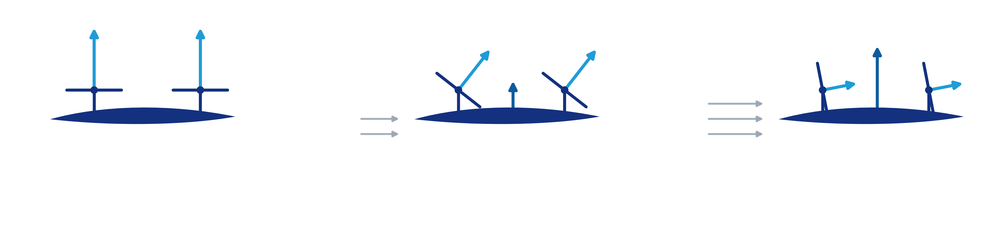
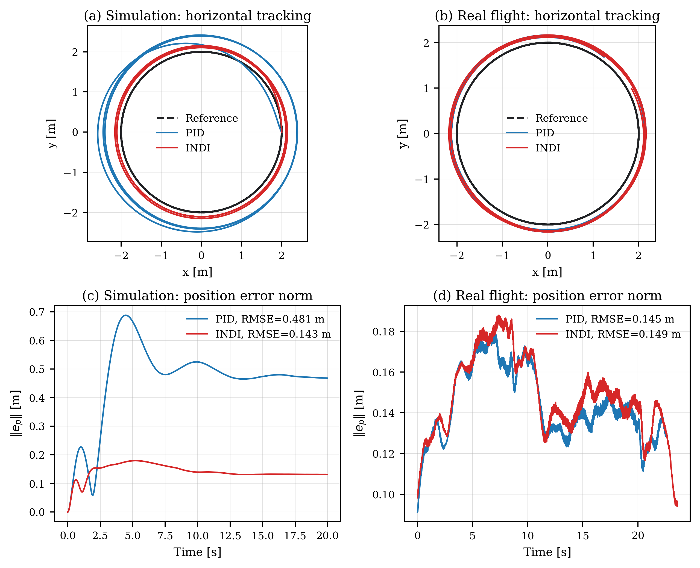
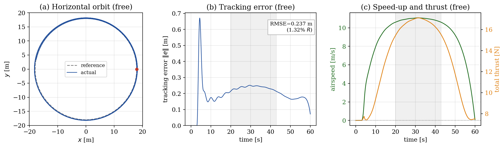
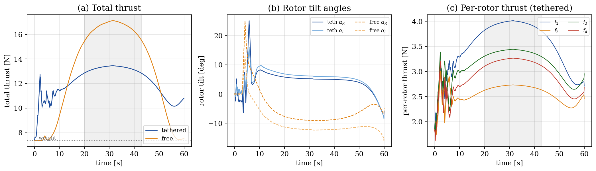

# INDI Control for Hybrid Tilt-Rotor UAVs

Public overview of a Research Project on cascaded Incremental Nonlinear Dynamic Inversion (INDI) control for hybrid tilt-rotor UAVs.

This repository presents the project at architecture and results level. It intentionally omits the full simulator source, detailed controller implementation, tuning files, raw logs, complete report, and complete defense deck.

## Project Scope

Hybrid tilt-rotor UAVs combine rotor-borne hover capability with fixed-wing lift in forward flight. This makes them attractive for longer-endurance missions, but difficult to control: the vehicle changes behavior across hover, transition, and cruise, while actuator limits and aerodynamic effects strongly influence the control allocation problem.

The project studied:

- 6 DoF rigid-body dynamics of a fixed-wing quad-tiltrotor;
- cascaded INDI control for trajectory tracking;
- weighted least-squares actuator allocation;
- aerodynamic lift and actuator-limit effects;
- wind and tether/cable disturbances;
- benchmark comparisons and cooperative payload-transport concepts.

## Contribution

The public material focuses on the parts that can be shown without releasing the full collaborative implementation:

- cascaded INDI control structure;
- mapping from position/velocity tracking errors to virtual acceleration commands;
- local control-effectiveness modelling;
- weighted least-squares allocation under actuator bounds and preferences;
- interpretation of tracking, control-effort, and stability results;
- selected figures prepared from the Research Project material.

## Documentation

| Document | Purpose |
|---|---|
| [Contribution summary](docs/contribution-summary.md) | Role and contribution scope |
| [Technical summary](docs/technical-summary.md) | Architecture-level technical explanation |
| [Report note](docs/report/README.md) | Why the full report is not mirrored |
| [Slides note](docs/slides/README.md) | Why the full defense deck is not mirrored |

## Selected Figures

<table>
  <tr>
    <td width="50%">
      
       <strong>Cascaded INDI architecture</strong>
    </td>
    <td width="50%">
      
       <strong>Hybrid tilt-rotor operating regimes</strong>
    </td>
  </tr>
  <tr>
    <td width="50%">
      
       <strong>Benchmark and real-flight tracking comparison</strong>
    </td>
    <td width="50%">
      
       <strong>Baseline cruise tracking response</strong>
    </td>
  </tr>
  <tr>
    <td width="50%">
      
       <strong>Control effort during cruise</strong>
    </td>
    <td width="50%">
      
<strong>Public-release note</strong>

      
Only a small representative subset of figures is included. Full implementation files and complete project deliverables are intentionally excluded.

    </td>
  </tr>
</table>

## Omitted Material

This public overview does not include:

- full Python simulator source;
- detailed controller implementation files;
- configuration and tuning files;
- complete report PDF;
- complete defense PowerPoint;
- raw simulation logs or datasets;
- third-party reference papers;
- collaborator files that are not necessary for public context.

The goal is to show the engineering content of the project without publishing material that should remain internal to the collaboration.
