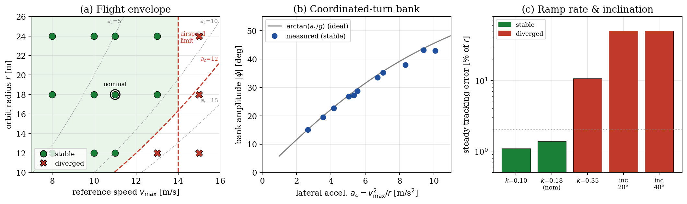
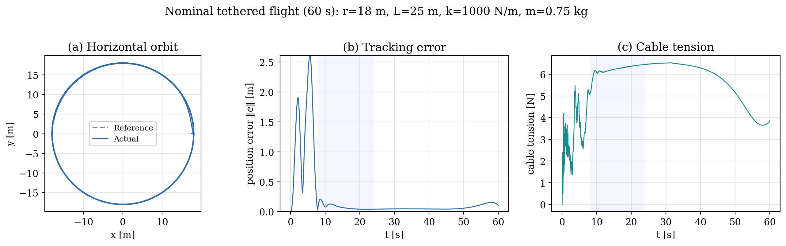
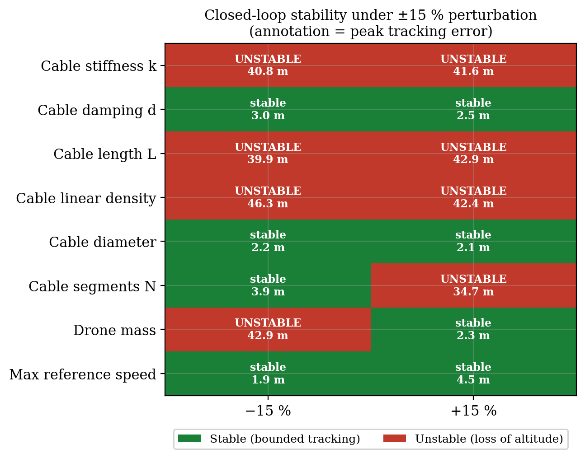
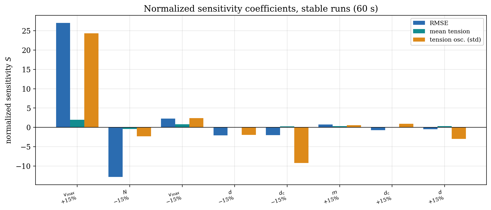
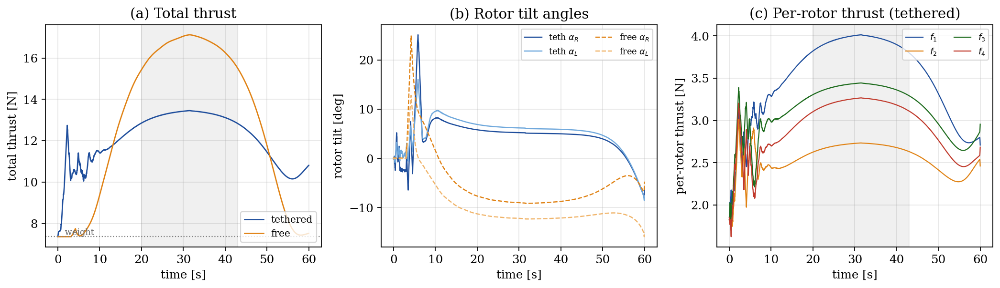

# Results Summary

This page summarizes the main results from the report and final presentation.

## Free-Flight Envelope

The cable-free vehicle tracks circular references accurately inside a bounded envelope. The report identifies two main practical limits:

| Limit | Approximate value |
|---|---:|
| Maximum reference speed | 14 m/s |
| Maximum lateral acceleration | 12 m/s² |

Inside the stable region, the vehicle behaves like a coordinated-turn aircraft: bank angle follows the lateral-acceleration demand while pitch remains small and rotor tilt provides forward propulsion.

The envelope study shows the tested combinations of reference speed and radius,
with instability appearing as the lateral-acceleration demand approaches the
control authority available to the vehicle.

## Nominal Tethered Orbit

The nominal tethered case uses a circular orbit around the ground anchor:

| Quantity | Value |
|---|---:|
| Orbit radius | 18 m |
| Cable length | 25 m |
| Maximum speed | 11 m/s |
| Simulation horizon | 60 s |

The tethered UAV tracks the reference orbit after the initial transient. In the sensitivity-window metrics, the nominal case has RMSE 0.087 m and mean cable tension 6.21 N with peak tension 6.5 N. The cable tension varies periodically, so the tether acts as a structured disturbance rather than a constant force.

The nominal tethered run remains close to the circular reference after the
initial transient, while the cable tension settles into a periodic load rather
than a constant offset.

## Cable Sensitivity

The cable sensitivity study perturbs one parameter at a time by ±15%.

| Parameter group | Observed effect |
|---|---|
| Cable stiffness, cable length, cable linear density | Stability-critical; perturbations can trigger altitude loss and large tension spikes |
| Vehicle mass | Stability-critical when reduced; changes the coupled UAV+tether operating point |
| Segment number | Can affect stability through cable discretization |
| Reference speed | Dominant driver of tracking error and tension oscillation among stable runs |
| Cable damping and diameter | Weaker influence in the tested range |

The main result is that the nominal case is accurate but close to the taut/slack boundary. This creates thin robustness margins, so future work should address cable pre-tension, load-aware trim and tether uncertainty.

The stability map highlights which perturbations cause loss of attitude, while
the sensitivity coefficients separate effects on tracking RMSE, mean tension and
tension oscillation among the cases that remain stable.

## Actuator Effort

The tether changes where effort is spent:

| Quantity | Tethered | Free |
|---|---:|---:|
| Tracking error, cruise window | 0.24% of R | 1.32% of R |
| Hover total thrust | 9.77 N | 7.36 N |
| Cruise total thrust | 13.2 N | 16.6 N |
| Mean rotor tilt | 5.2/6.2° | -8.7/-12.0° |
| Rotor-speed command activity | 5.2 rad/s² | 9.4 rad/s² |

The cable increases thrust demand in hover, but during cruise it contributes inward force toward the anchor and reduces the mean thrust required for the circular orbit. It also shifts the rotor-tilt trim by roughly 15°.

The effort comparison shows the main trim shift caused by the tether: higher
hover thrust demand, lower mean thrust in cruise, and different rotor-tilt
angles once the cable contributes inward force.

## Quadrotor Benchmark

The appendix includes a PID-vs-INDI benchmark on a quadrotor platform.

| Case | PID RMSE | INDI RMSE |
|---|---:|---:|
| Simulation | 0.481 m | 0.143 m |
| Real flight | 0.145 m | 0.149 m |

The real-flight result is interpreted cautiously: it shows the INDI implementation is viable and not more aggressive in command activity, but it is not claimed as full validation of the hybrid tethered system.
